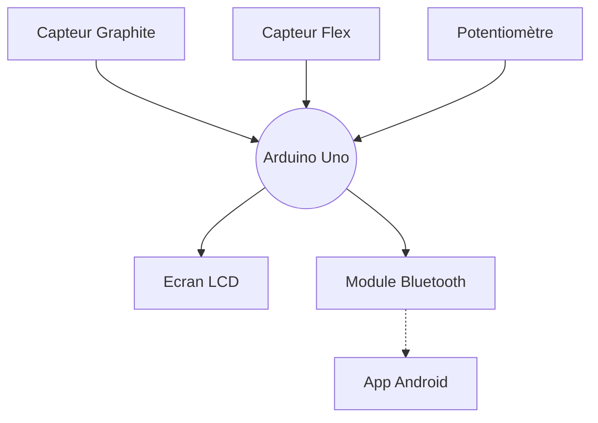

# Projet MOSH
## Par Quentin et Laetitia 🥇
### ~~Le meilleur binôme~~ (il faut pas le dire) 

Cohésion d'équipe ☑️
## Diagramme du projet

  Etapes du projet MOSH :tada:  

  
  - [x] Attribution des inputs de l'arduino aux différents capteurs
  - [X] Electronique Analogique
  - [x] Schématique KiCad  
  - [x] Routage KiCad
  - [x] Impression du cricuit
  - [x] Percage
  - [ ] Montage des capteurs sur le circuit imprimé
  - [ ] Code Arduino
  - [ ] App Android
  - [ ] Création du banc de test
  - [ ] Création de la datasheet
        

> [!IMPORTANT]
  > Le projet n'est pas encore finalisé

# Quel est ce projet ?

Ce projet consiste en...

 la création d'un capteur Graphite. 

Un capteur graphite, c'est tout simplement un morceau de papier où l'on colorie une zone à l'aide d'un crayon à papier. Il permet de mesurer des variations de résistance lorqu'on le déforme. Voici la forme de capteur que nous utilisons : (insérer la photo).

 la création d'un shield Arduino. 

Cela permet d'effectuer les acquisitions des données envoyées par notre capteur (des variations de tensions que nous pouvons traduire en résistance !). 
Nous y implémenterons également un capteur Flex dont voici la datasheet : (insérer la datasheet), un écran LCD pour afficher les données du capteur graphite ou du capteur flex, un potentiomètre qui permettra à l'utilisateur de naviguer dans un menu qui permet d'afficher les données du capteur graphite ou du capteur flex, un potentiomètre numérique qui permettra d'ajuster une résistance pour la maniulation des données du capteur graphite,... 

Pour cela, il nous faut créer le shield sous KiCad, le faire imprimer, percer le trous, et y monter nos capteurs.

 la création d'un code Arduino. 

Le code permettra de commander le microcontrôleur Arduino Uno : gestion des données, commnication Bluetooth (voir App android), choix de la résistance du potentiomètre numérique, affichage sur l'écran LCD...

 la création d'une App Android. 

Notre projet s'accompagne également d'une App Android : grâce à la communication Bluetooth, nous pouvons afficher sur un smartphone des graphiques des données enregistrées par nos deux capteurs. Nous créons l'app sur MIT App Inventor (insérer le lien).

# Je veux aller voir...
 __(cliquez)__ 

## L'Electronique Analogique 

 Explications. 

    
Vous trouverez dans ce dossier le circuit analogique du capteur graphite. Il y a un amplificateur transimpédance et un filtre qui permettent d'obtenir un signal utilisable. En effet, le signal délivré par le capteur sans ce circuit est trop faible : il a un courant moyen de 100nA, donc il faudrait un microcontrôleur très précis pour pouvoir détecter des variations sur ce signal. C'est pourquoi nous l'amplifions. 

Les filtres sont nécessaires afin d'élminer les fréquences 50Hz dans lesquelles nos environnements sont baignés (à cause du réseau électrique), et d'autres fréquences parasites.

Voici un schéma, qui est une capture d'écran de nos simulations LTSpice : 

(insérer photo avec rectangles)

Les parties qui servent à filtrer sont dans les rectangles :
- le rectangle vert, avec une capacité de 100n, sert à filtrer le signal d'entrée. C'est un filtre passe-bas. Sa fréquence de transition est d'envirion 159Hz (formule f=1/(2*pi*R*C)). Il permet donc d'éliminer le bruit qui pourrait naître à l'entrée du circuit.
- le rectangle violet a une fonction similaire : c'est un filtre passe-bas, qui permet de filtrer le bruit en sortie, de fréquence de transition de 1591Hz.
- le rectangle rouge entoure le filtre passe-bas qui permet de filtrer le bruit environnant à 50Hz.

Le reste du circuit permet de réaliser l'amplifictation du signal. 

## Le KiCad ! [C'est ici](https://github.com/MOSH-Insa-Toulouse/2023-2024-LEROI-FABRE/tree/main/KiCad)

 Explications. 

    
Nous avons créé des empreintes KiCad pour notre capteur graphite, et pour les éléments qui ne sont pas déjà disponibles dans a librairie intégrée KiCad. Vous pouvez les retrouver dans le dossier KiCad. 

Nous avons ces contraintes pour la fabrication de nos shields : 
- largeur de routage de 0.5mm minimum.
- largeur de 0.5mm minimum entre différents routages afin d'assurer l'isolation électrique.
- nous avons élargi les pads du module bluetooth, de l'encodeur rotatoire, de l'écran OLED et des connecteurs du header à 2*2.54 (oval).
- vias de 0.8mm, cercle de 2.54mm.

Cela assure le fonctionnement du shield, et nous permet de percer les vias facilement.

## Non, je veux voir le code Arduino [Juste là](https://github.com/MOSH-Insa-Toulouse/2023-2024-LEROI-FABRE/tree/main/Arduino%20V2/projet_capteur) 

 Explications. 

Ce code a toutes ces fonctionalités :
- gère l'affichage sur l'écran OLED via une fonction.
- l'interruption DoEncodeur est réalisée à chaque fois que quelqu'un tourne l'encodeur rotatoire : l'utilisateur tourne l'encodeur, et au prochain tick de clock, linterruption sera réalisée. Elle permet d'ajouter +1 à la valeur que compte l'encodeur. Celui-ci sert à gérer le menu de l'écran OLED. Le principe est que lorsque nous tournons l'encodeur, c'est pour changer l'affichage de l'écran. Ainsi, si la valeur comptée par l'encodeur est paire nous aurons un afichage (capteur Flex), et s'il est impair, nous aurons un autre affichage (capteur graphite).
- la communication Bluetooth : nosu envoyons les données du capteur graphite ou du capteur flex à une application MIT via bluetooth. Si le module bluetooth recoit 1 de la part de l'application, c'est que l'utilisateur a appuyé sur le bouton "capteur flex". S'il recoit 2, c'est que l'utilisateur a appuyé sur "capteur graphite" dans l'app.
- la modification de la résistance du potentiomètre numérique : cela permet de calibrer le signal renvoyé par le capteur graphite.

  

## Je préfère voir l'app Android [Okay...](https://github.com/MOSH-Insa-Toulouse/2023-2024-LEROI-FABRE/tree/main/App%20Android)

## Des photos du projet, plutôt ! 📷 [Ici](https://github.com/MOSH-Insa-Toulouse/2023-2024-LEROI-FABRE/tree/main/Images)

