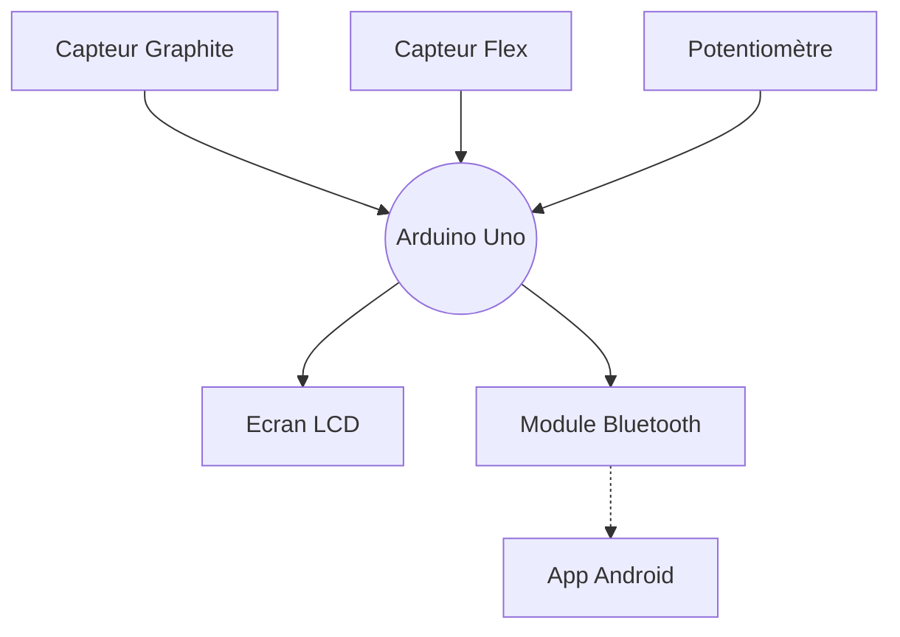

# Projet MOSH
## Par Quentin et Laetitia 🥇
### ~~Le meilleur binôme~~ (il faut pas le dire) 

Cohésion d'équipe ☑️
## Diagramme du projet

  Etapes du projet MOSH :tada:  

  
  - [x] Attribution des inputs de l'arduino aux différents capteurs
  - [x] Schématique KiCad  
  - [x] Routage KiCad
  - [x] Impression du cricuit
  - [x] Percage
  - [ ] Montage des capteurs sur le circuit imprimé
  - [ ] Code Arduino
  - [ ] App Android
  - [ ] Création du banc de test
  - [ ] Création de la datasheet
        

> [!IMPORTANT]
  > Le projet n'est pas encore finalisé

# Quel est ce projet ?

Ce projet consiste en...

 la création d'un capteur Graphite. 

Un capteur graphite, c'est tout simplement un morceau de papier où l'on colorie une zone à l'aide d'un crayon à papier. Il permet de mesurer des variations de résistance lorqu'on le déforme. Voici la forme de capteur que nous utilisons : (insérer la photo).

 la création d'un shield Arduino. 

Cela permet d'effectuer les acquisitions des données envoyées par notre capteur (des variations de tensions que nous pouvons traduire en résistance !). 
Nous y implémenterons également un capteur Flex dont voici la datasheet : (insérer la datasheet), un écran LCD pour afficher les données du capteur graphite ou du capteur flex, un potentiomètre qui permettra à l'utilisateur de naviguer dans un menu qui permet d'afficher les données du capteur graphite ou du capteur flex, un potentiomètre numérique qui permettra d'ajuster une résistance pour la maniulation des données du capteur graphite,... 

Pour cela, il nous faut créer le shield sous KiCad, le faire imprimer, percer le trous, et y monter nos capteurs.

 la création d'un code Arduino. 

Le code permettra de commander le microcontrôleur Arduino Uno : gestion des données, commnication Bluetooth (voir App android), choix de la résistance du potentiomètre numérique, affichage sur l'écran LCD...

 la création d'une App Android. 

Notre projet s'accompagne également d'une App Android : grâce à la communication Bluetooth, nous pouvons afficher sur un smartphone des graphiques des données enregistrées par nos deux capteurs. Nous créons l'app sur MIT App Inventor (insérer le lien).

# Je veux aller voir...
 __(cliquez)__ 
## Le KiCad ! [C'est ici](https://github.com/MOSH-Insa-Toulouse/2023-2024-LEROI-FABRE/tree/main/KiCad)

## Non, je veux voir le code Arduino [Juste là](https://github.com/MOSH-Insa-Toulouse/2023-2024-LEROI-FABRE/tree/main/Arduino%20V2/projet_capteur) 

## Je préfère voir l'app Android [Okay...](https://github.com/MOSH-Insa-Toulouse/2023-2024-LEROI-FABRE/tree/main/App%20Android)

## Des photos du projet, plutôt ! 📷 [Ici](https://github.com/MOSH-Insa-Toulouse/2023-2024-LEROI-FABRE/tree/main/Images)

