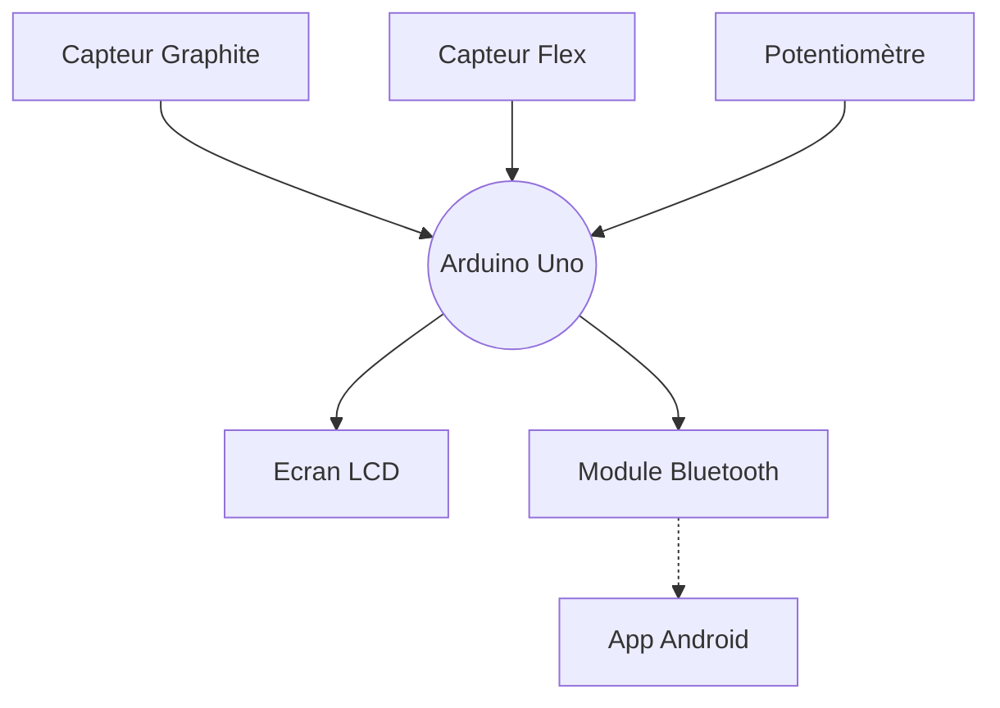

# Projet MOSH
## Par Quentin et Laetitia 🥇
### ~~Le meilleur binôme~~ (il faut pas le dire) 

Cohésion d'équipe ☑️
## Diagramme du projet

  Etapes du projet MOSH :tada:  

  
  - [x] Attribution des inputs de l'arduino aux différents capteurs
  - [x] Schématique KiCad  
  - [x] Routage KiCad
  - [x] Impression du cricuit
  - [x] Percage
  - [ ] Montage des capteurs sur le circuit imprimé
  - [ ] Code Arduino
  - [ ] App Android
  - [ ] Création du banc de test
  - [ ] Création de la datasheet
        

> [!IMPORTANT]
  > Le projet n'est pas encore finalisé

# Je veux aller voir...
 __(cliquez)__ 
## Le KiCad ! [C'est ici](https://github.com/MOSH-Insa-Toulouse/2023-2024-LEROI-FABRE/tree/main/KiCad)

## Non, je veux voir le code Arduino [Juste là](https://github.com/MOSH-Insa-Toulouse/2023-2024-LEROI-FABRE/tree/main/Arduino%20V2/projet_capteur) 

## Je préfère voir l'app Android [Okay...](https://github.com/MOSH-Insa-Toulouse/2023-2024-LEROI-FABRE/tree/main/App%20Android)

## Des photos du projet, plutôt ! 📷 [Ici](https://github.com/MOSH-Insa-Toulouse/2023-2024-LEROI-FABRE/tree/main/Images)

